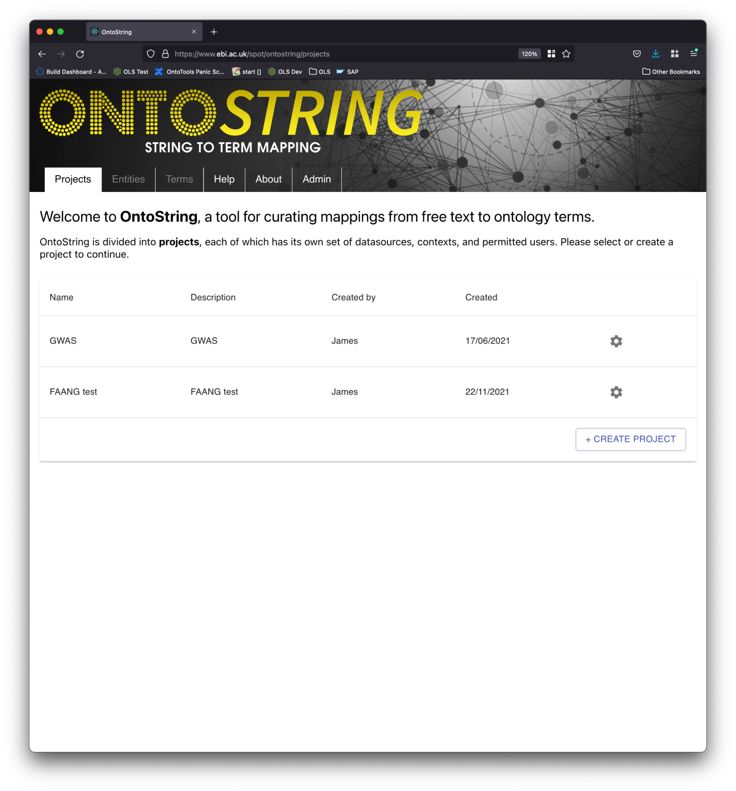
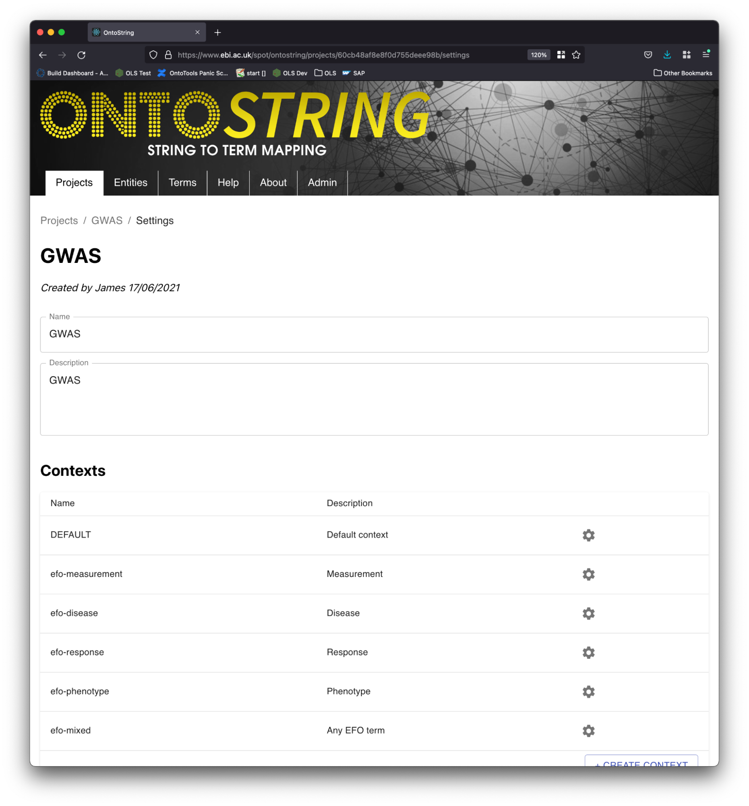
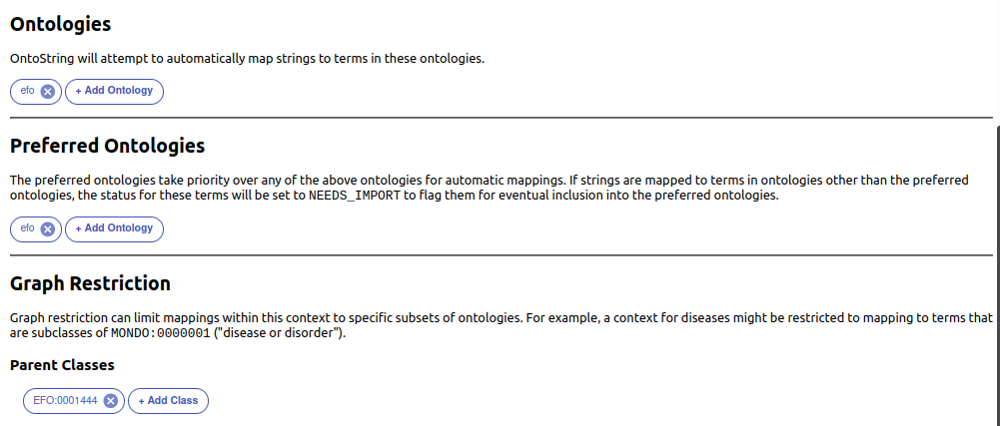
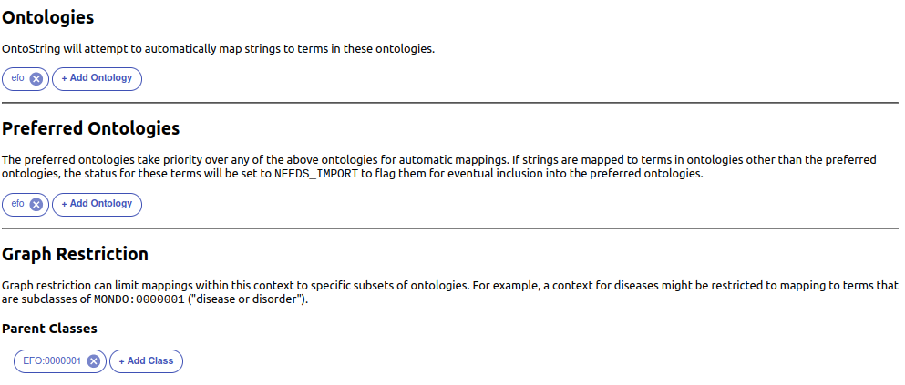
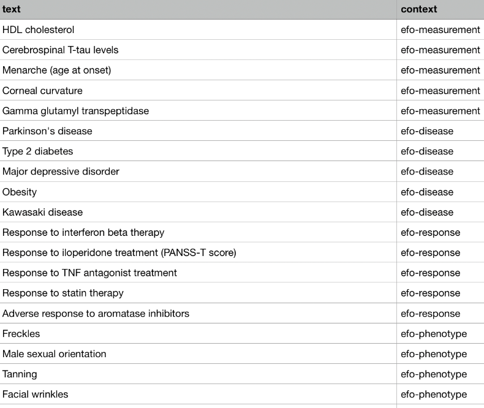
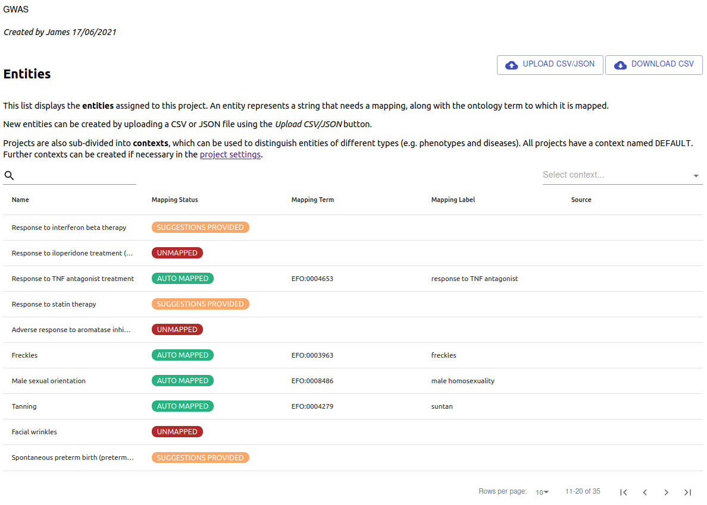
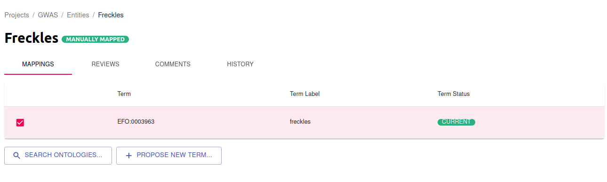
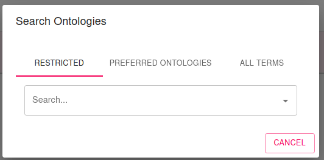
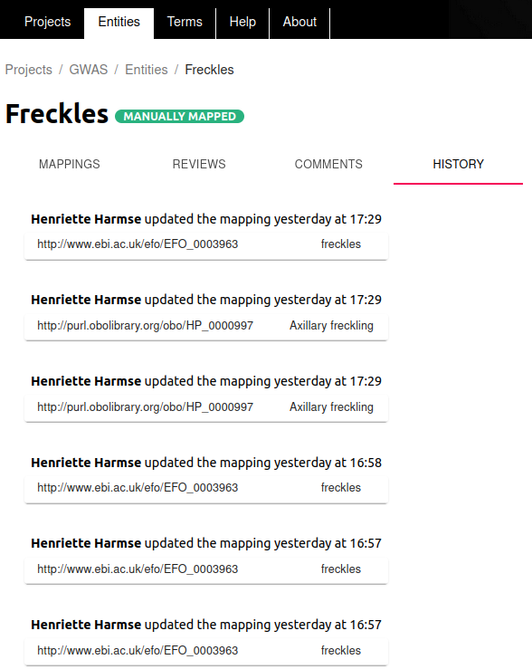

# Tutorial

This tutorial describes the use case and concepts of OntoString and its realisation in OntoString.

## Use case and key concepts

The main purpose of OntoString is to enable the interactive mapping of strings of text to ontology terms. 

### Projects

Depending on the particular use case, the same string of text may need to be mapped to different ontology terms. 
In order to cater for this requirement, OntoString uses projects to distinguish between distinct use cases. An example 
of this is at EBI we have the Genome-wide Association Study (GWAS) and the Functional Annotation of Animal Genomes 
(FAANG) teams. These are distinct teams within EBI dealing with completely different datasets and using different 
ontologies to annotate their data with. Thus, for this reason we set 2 different **projects**, as illustrated below:

### Contexts

For a distinct use case like GWAS, they may know that in general they want to map terms to EFO. But 
depending on the scenario, they may want to restrict mappings to a particular branch within EFO. Here 
are some examples of different scenarios GWAS wants to cater for:

* Measurement - When they are dealing with measurements they want to map to terms in EFO that are restricted to 
subclasses of `EFO:0001444` (measurement).
* Disease - When dealing with diseases, terms should be mapped to subclasses of `EFO:0000408` (disease).
* GWAS has similar needs for dealing with responses and phenotypes.
* Mixed - Sometimes GWAS cannot be sure of the context beyond knowing that all terms should be mapped to EFO.

These different scenarios are created as different **contexts** within the GWAS project. This is illustrated in the screenshot below.

In the next screenshot we show how the *efo-measurement* context described above, is configured by specifying 
`EFO:0001444` as a parent under the **Graph Restriction** section.

To restrict the *efo-mixed* context to any terms within EFO, it is defined as follows. Note that `EFO:0000001` is the
root term of EFO.

### How to provide a list of strings of text to be mapped?

Now we know that OntoString uses projects and contexts to map strings of text to ontology terms. But how does one 
provide the text that needs to be mapped to OntoString? This is achieved by uploading a CSV/JSON file to OntoString, 
specifying the string of text to be mapped and the context to be used. Here is an example:

### How to review mappings?

When an upload is done, OntoString will try to map each string of text to an ontology term(s) based on the context using 
existing mappings in OntoString, as well as any Zooma datasources that have been configured for that particular project. 
Once complete, the user will be presented with a screen listing the strings to be mapped, a status indicating whether the 
string could be automatically mapped (**automapped**), whether suggestions could be provided (**suggestion provided)**, or whether 
no mapping could be made (**unmapped**). See screenshot below. 

A user can amend these mappings by selecting the relevant row. This will allow the user to review and update the mapping 
for the string of text. Any changes to a mapping will cause the status of the mapping to change to **manually mapped**.

A single string of text can be mapped to 1 or more terms. In the screenshot above _Freckles_ is mapped to only 1 term 
which is `EFO:0003963`. If this mapping is incorrect, the checkbox next to it can be unchecked to unmap it. To map 
_Freckles_ to other terms, the `Search ontologies…` button can be clicked to search for other terms. The following dialog 
will be displayed:

All changes to mappings are tracked through an audit trail. An example of this can be seen below:

